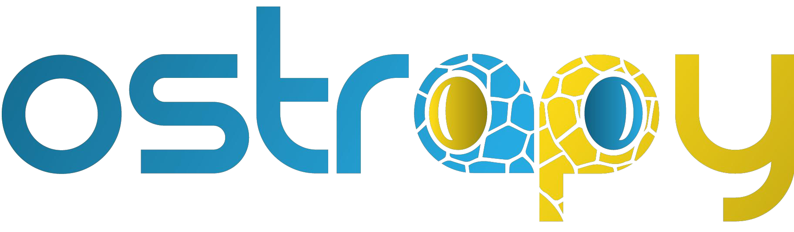

# Welcome!
Welcome to Python programming workshop for bioinformatics Ostrapy. The main goal of this project is to spread knowledge and teach people how to use Python efficiently in their scientific projects. Students will learn basic programming concepts, essentials of Biopython package (working with fasta files, blast, Entrez database) and some key packages for data science in Python (numpy, pandas, matplotlib).

## General info

  :date: 09-13 December 2020

 :school: online

 :moneybag: Free

 :clipboard: [registration form](https://forms.gle/t1piEpAA9b1AHtNX7)

 :e-mail: zihaladavid@gmail.com

## Preliminary Program

### Day 1 (4 pm - 8pm):
Introduction \
Basic data types \
Control statements \
Working with files \
Functions 

### Day 2 (4 pm - 8 pm):
Classes \
Modules \
Packages

### Day 3 (4 pm - 8 pm):
Regular expressions \
Biopython – SeqIO

### Day 4 (9 am - 3 pm):
Everything from previous days \
Biopython - AlignIO \
Biopython - Blast \
Biopython - Entrez

### Day 5 (9 am - 3 pm):
Everything from previous days \
pandas, matplotlib 

## literature :books:

[mice book](https://leanpub.com/python_101)\
[python for biologist](https://books.google.com.tr/books/about/Python_for_Biologists.html?id=vnArvvqC918C&source=kp_book_description&redir_esc=y)
