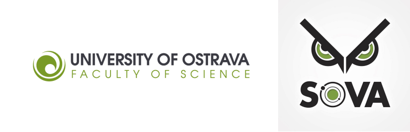

# Welcome!
Welcome to Python programming workshop for bioinformatics Ostrapy. The main goal of this project is to spread knowledge and teach people how to use Python efficiently in their scientific projects. Students will learn basic programming concepts, essentials of Biopython package (working with fasta files, blast, Entrez database) and some key packages for data science in Python (numpy, pandas, matplotlib).

## General info

  :date: 09-13 December 2020

 :venue: online

 :moneybag: Free

 :clipboard: [registration form](https://forms.gle/t1piEpAA9b1AHtNX7)

 :e-mail: zihaladavid@gmail.com

**University of Ostrava, SOVA**

## Preliminary Program

### Day 1:
9:00 – 9:30	Introduction\
9:30 – 11:00	Basic data types\
11:00 – 11:15  Coffee break  :coffee:\
11:15 – 12:30 Control statements(1), Exception handling\
12:30 – 13:30 Lunch break :fork_and_knife:\
13:30 – 15:00 Control statements(2), working with files\
15:00 – 15:15 Coffee break :coffee:\
15:15 – 17:00 Functions

### Day 2:
9:00 – 11:00 Working with files, string formatting\
11:00 – 11:15  Coffee break :coffee:\
11:15 – 12:30 Classes\
12:30 – 13:30 Lunch break :fork_and_knife:\
13:30 – 15:00 Modules, Packages, Introduction to standard library\
15:00 – 15:15 Coffee break :coffee:\
15:15 – 17:00 Generators, Iterators

### Day 3:
9:00 – 11:00 Regular expressions\
11:00 – 11:15  Coffee break :coffee:\
11:15 – 12:30 Classes(2)\
12:30 – 13:30 Lunch break :fork_and_knife:\
13:30 – 15:00 Biopython – SeqIO

### Day 4:
9:00 – 11:00 Biopython - AlignIO\
11:00 – 11:15  Coffee break :coffee:\
11:15 – 12:30 Biopython – Blast.NCBIWWW\
12:30 – 13:30 Lunch break :fork_and_knife:\
13:30 – 15:00 Biopython – Blast.NCBIXML\
15:00 – 15:15 Coffee break :coffee:\
15:15 – 17:00 Biopython - Entrez

### Day 5:
9:00 – 11:00 Introduction to scientific Python\
11:00 – 11:15  Coffee break :coffee:\
11:15 – 12:30 pandas\
12:30 – 13:30 Lunch break :fork_and_knife:\
13:30 – 15:00 Matplotlib\
15:00 – 15:15 Coffee break :coffee:\
15:15 – 17:00 More pandas and Matplolib

## literature :books:

[mice book](https://leanpub.com/python_101)\
[python for biologist](https://books.google.com.tr/books/about/Python_for_Biologists.html?id=vnArvvqC918C&source=kp_book_description&redir_esc=y)
